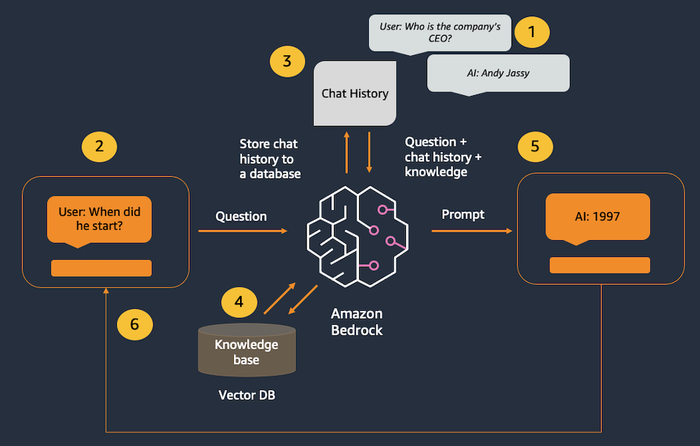
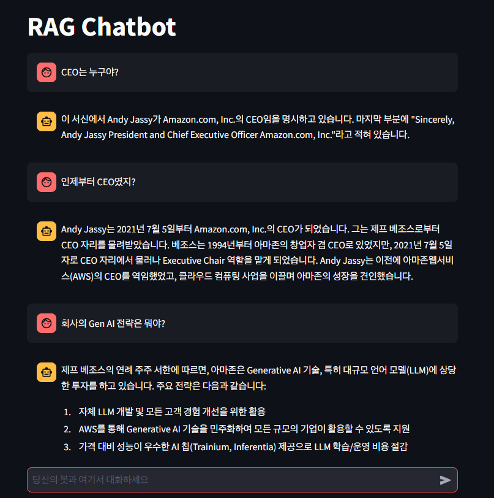

# Rag Chatbot

## 개요

- Amazon Bedrock(및 일반적으로 LLM)에는 상태나 메모리에 대한 개념이 없음
- 모든 채팅 기록은 외부에서 추적한 다음 새 메시지가 들어올 때마다 모델에 전달해야 함.
- 채팅 기록을 추적하기 위해 LangChain의 `ConversationBufferWindowMemory` 클래스를 사용
- 모델에서 처리할 수 있는 토큰 수에는 제한이 있음
- 때문에 사용자의 메시지와 모델의 응답을 처리할 수 있는 충분한 공간이 남도록 채팅 기록을 잘라내야 함
- `ConversationBufferWindowMemory`는 가장 최근 메시지를 추적하여 이를 지원

## 개선점

- 검색 증강 생성 (RAG; Retrieval-Augmented Generation) 을 통해 모델의 기본 데이터를 외부 지식으로 보완
- LangChain의 `ConversationalRetrievalChain` 클래스를 사용해 한 번의 호출로 챗봇과 RAG 기능을 결합

## 목표

- 증강 생성(RAG)이 지원하는 챗봇을 구축
- `Anthropic Claude`, `Amazon Titan Embeddings`, `LangChain`, `Streamlit` 사용
- **인메모리 FAISS 데이터베이스**를 사용하여 RAG 패턴을 시연
- 실제 시나리오에서는 `Amazon Kendra`와 같은 영구 데이터 저장소나 `Amazon OpenSearch` 서버리스용 벡터 엔진을 사용할 가능성이 높음

## 아키텍처

- 지난 상호작용이 채팅 메모리 객체에서 추적
- 사용자가 새 메시지를 입력
- 채팅 기록이 메모리 객체에서 검색되어 새 메시지 앞에 추가
- 타이탄 임베딩을 사용하여 질문을 벡터로 변환한 다음 벡터 데이터베이스에서 가장 가까운 벡터와 매치
- 결합된 기록, 지식 및 새 메시지가 모델로 전송
- 모델의 응답이 사용자에게 표시

## 결과

