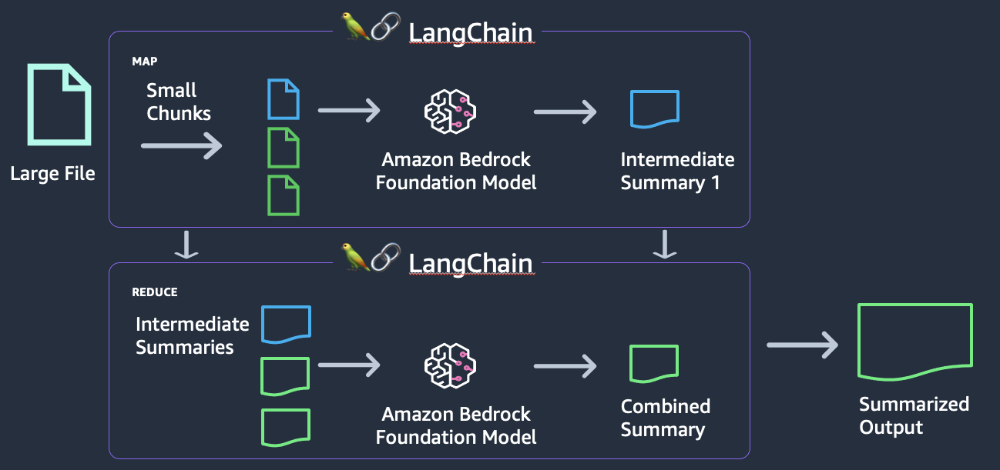
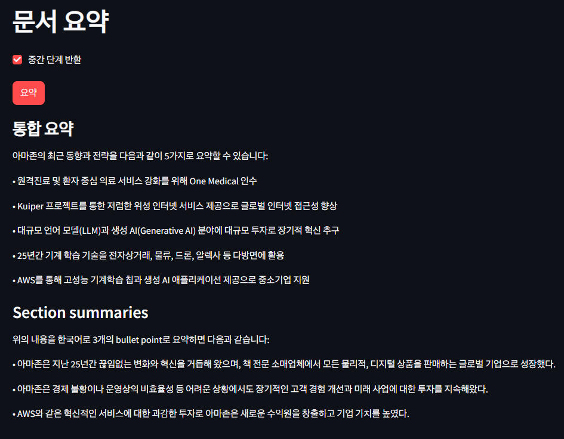

# 문서 요약기

`Amazon Bedrock`, `LangChain`, `Streamlit`을 사용한 **간단 문서 요약기**

- `LangChain`에는 모델의 토큰 한도를 초과하는 콘텐츠를 처리할 수 있는 맵-리듀스 요약 기능이 포함되어 있음
- 맵-리듀스 기능은 문서를 작은 조각으로 나누고, 해당 조각들을 요약한 뒤, 그 다음 조각들의 요약을 요약하는 방식으로 작동

## 맵-리듀스 요약 패턴의 사용 사례

- 긴 문서 요약
- 통화 기록 요약
- 고객 활동 기록 요약

## 아키텍처

맵-리듀스 패턴에는 다음 단계가 포함됨

1. 큰 문서를 작은 청크로 나누기
2. 작은 청크를 기반으로 중간 요약 생성
3. 중간 요약들을 통합 요약으로 요약

## 결과

