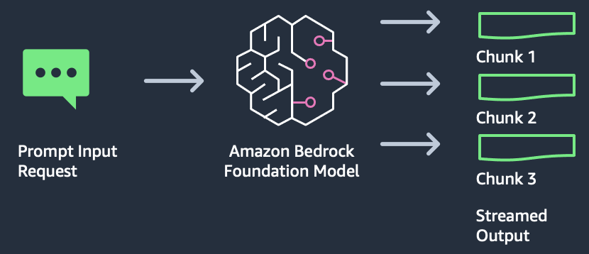
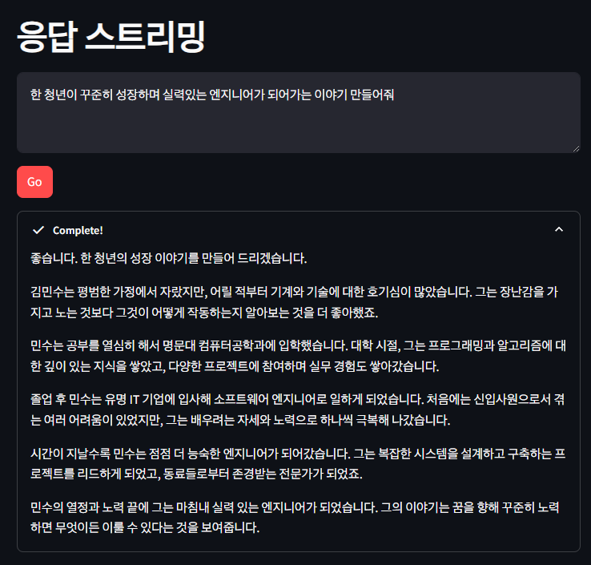

# 응답 스트리밍

`Bedrock`, `Boto3`, `Streamlit을` 사용한 응답 스트리밍 어플리케이션

- 스트리밍 응답은 최종 사용자에게 콘텐츠를 즉시 반환하고 싶을 때 유용
- 전체 응답이 생성될 때까지 기다리지 않고 한 번에 몇 단어식 출력 표시 가능

## 사용 사례

- 긴 텍스트가 생성되지만 즉시 응답을 반환하기 시작하여 사용자의 참여를 유지하려는 상황

## 아키텍처

- 스트리밍 출력이 생성되는 즉시 처리할 수 있는 특수 핸들러 추가
- 스트리밍된 응답을 JSON 청크로 반환.
- 각 청크에서 반환된 텍스트를 추출하여 최종 사용자에게 표시

## 결과

