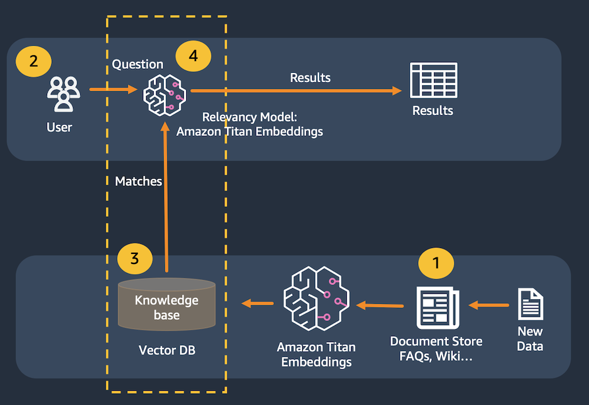
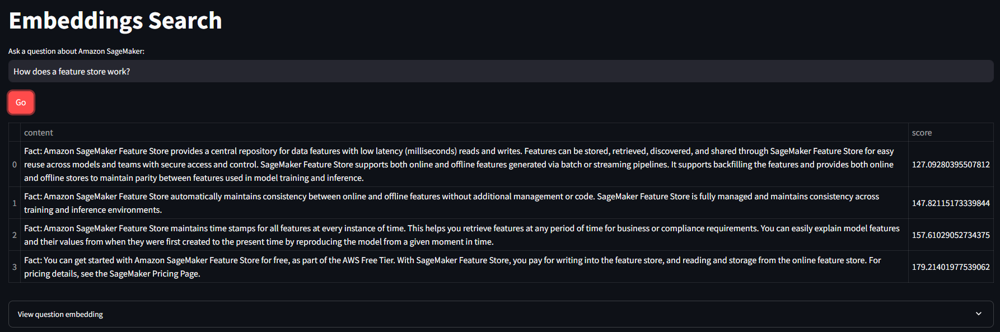

## 임베딩 검색

`Amazon Titan Embedding`, `LangChain`, `Streamlit`을 사용한 간단 검색 애플리케이션 구축  

- 임베딩 벡터를 저장하고 검색하기 위해 인메모리 `FAISS` 데이터베이스 사용
- 실제 시나리오에서는 Amazon Kendra와 같은 영구 데이터 저장소나 Amazon OpenSearch 서버리스용 벡터 엔진 사용 권장

---

- 쿼리를 벡터 테이터베이스에서 가장 가까운 항목과 일치시키기
- 일치 항목을 대규모 언어 모델에 전달하는 대신 사사용자 인터페이스에 직접 표시
- 해당 방법은 RAG 애플리케이션의 문제를 해결하거나 임베딩 모델을 직접 평가하려는 경우 유용

## 사용 사례

- 텍스트 설명을 기반으로 관련 항목 식별
- 애플리케이션 포트폴리오 합리화 - 특히 회사나 부서 간의 데이터가 일치하지 않는 경우, 설명을 기반으로 애플리케이션을 일치시키면 잠재적인 중복 항목을 찾는 프로세스를 가속화할 수 있음

## 아키텍처

- 문서를 텍스트 청크로 분할
- 해당 청크를 Titan Embedding으로 전달 후 벡터로 변환
- 변환된 벡터를 벡터 데이터베이스에 저장
- 사용자가 질문을 제출합니다.
- 질문은 Amazon Titan Embeddin을 사용하여 벡터로 변환
- 벡터 데이터베이스에서 가장 가까운 벡터와 매칭
- 일치하는 벡터에서 결합된 콘텐츠가 사용자에게 반환

## 결과

