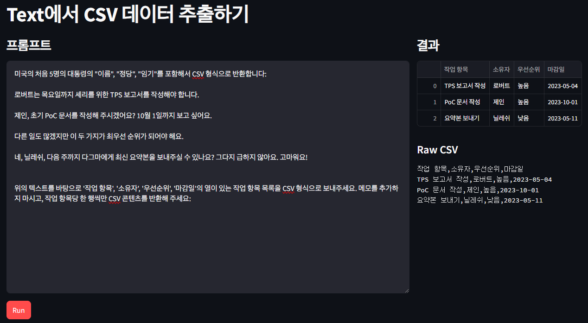

## 임베딩 검색

`Bedrock`, `LangChain`, `Streamlit을` 사용한 CSV 생성기

- 텍스트를 CSV로 변환하면 비정형 콘텐츠에서 표 형식의 데이터를 추출할 수 있음
- ex) 고객의 이메일에서 참조된 제품, 언급된 직원, 감정, 계좌 번호 및 프롬프트에 따라 모델이 감지할 수 있는 기타 모든 정보 추출

## 사용 사례

- 이메일 데이터 추출
- 통화 기록 데이터 추출
- 문서 데이터 추출
- 샘플 데이터 세트 생

## 아키텍처

- LLM에서 반환된 텍스트를 CSV 출력으로 안전하게 변환
  
## 결과

